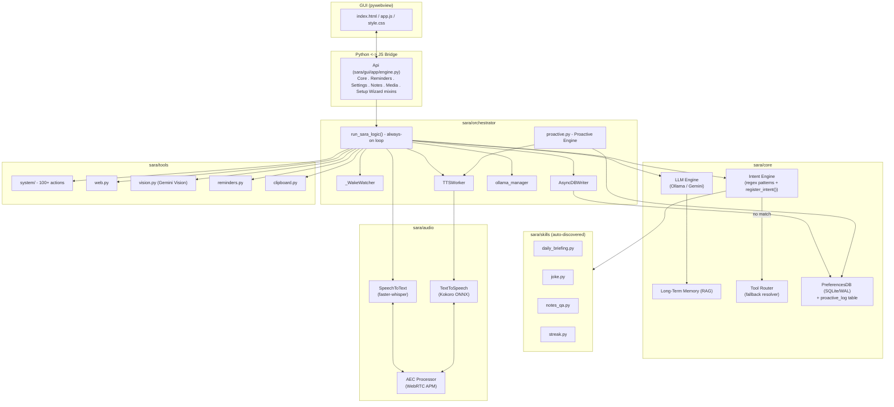
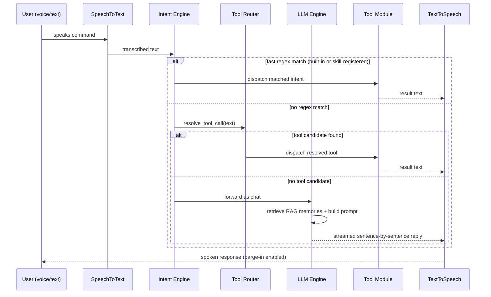
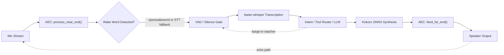
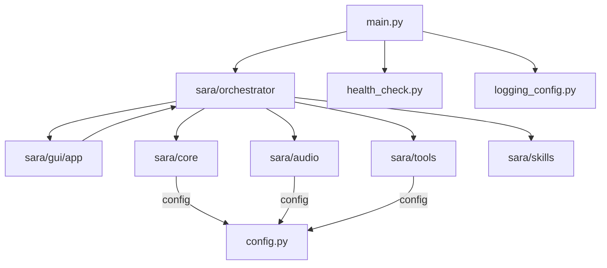

# PROJECT_MEMORY.md — Sara AI

Living reference for the current state of the project. Read this first
in any new conversation about Sara AI, alongside `CHANGELOG.md` (what
happened, in order) and `NEXT_STEPS.md` (what's pending).

**Source of truth for this revision:** `CHANGES_SUMMARY.md` (the merge of
the "final" feature-update zip into the audited base project, plus
regression fixes). This file has been rewritten against that document —
if the two ever disagree in the future, `CHANGES_SUMMARY.md` wins until
this file is regenerated from it again.

## What this project is

Python desktop AI assistant (JARVIS-style). Wake-word activated, bilingual
(English/Hindi/Hinglish), fully local-first (Ollama + faster-whisper +
Kokoro ONNX TTS), with a pywebview glassmorphic GUI. Portfolio project for
AI/ML and Data Science placements at product companies.

**Constraint that shapes every design decision here: fast, free,
low-latency.** Avoid paid APIs and heavy/slow dependencies unless
explicitly opted into (e.g. Gemini is an optional LLM backend, not the
default).

## Current state (as of the feature merge described in CHANGES_SUMMARY.md)

The project has been through two major rounds of work, both still
in effect:

1. A **full structural refactor** — every monolithic file (600–1700+
   lines) was split into small, focused packages, with zero features
   removed or behavior changed (see the older CHANGELOG entry below for
   the full file-by-file breakdown). This is the package layout shown
   under "Architecture" below.
2. A **feature merge** on top of that refactor, adding the Proactive
   Engine, the Explainable-AI `why_proactive` intent, the skills plugin
   system, and the Setup Wizard — plus fixing three regressions that a
   "final" feature-update zip had silently introduced, and a codebase-wide
   unused-import cleanup. Full detail in `CHANGELOG.md`'s newest entry.

### Architecture

```
sara/
├── audio/
│   ├── stt/          (was 1265-line stt.py)   helpers.py, buffers.py, engine.py
│   ├── tts/          (was 1057-line tts.py)   voice_params.py, text_prep.py, cache.py, synth.py, player.py, engine.py
│   └── aec.py         (unchanged)
├── core/
│   ├── llm/            (was 1080-line llm.py) prompt.py, streaming.py, clients.py, engine.py
│   ├── intent/           (was 921-line intent.py) patterns.py (data table, runtime skill
│   │                      intents inserted at the FRONT of the list), engine.py (matching),
│   │                      register_intent() — used by the skills auto-discovery system
│   ├── memory.py           PreferencesDB — SQLite/WAL. Tables: preferences, conversation_log,
│   │                        proactive_log (new). Methods include log_proactive_event(),
│   │                        get_recent_proactive_events(), get_last_proactive_event(),
│   │                        get_proactive_stats(), record_interaction_day(), get_streak_count(),
│   │                        get_conversation_stats() (backs the Shareable Moments card)
│   ├── rag.py                LongTermMemory — semantic long-term recall, also used by
│   │                          the notes_qa skill (see below)
│   └── tool_router.py           Rule-based tool-call fallback resolver — this DOES exist in
│                                  the codebase and is wired into the request flow (fast regex
│                                  intent match → tool_router fallback → LLM chat). Do not
│                                  claim it's missing; an earlier revision of this file was wrong.
├── tools/
│   ├── system/          13 category files + dispatch.py (SIMPLE_ACTIONS table)
│   │   └── system_info.py    now also has get_battery_raw() — numeric (percent, plugged)
│   │                          tuple used by the Proactive Engine's battery-low check
│   ├── reminders.py        now also has get_upcoming(within_minutes) — used by the
│   │                        Proactive Engine's reminder heads-up; purely additive, does not
│   │                        change the existing on-time alarm in _check_due_reminders()
│   ├── web.py, clipboard.py, vision.py   (unchanged)
├── gui/
│   └── app/              events.py, helpers.py, core.py, reminders.py, settings.py, notes.py,
│                          media.py, engine.py (mixin composition), bootstrap.py,
│                          setup_wizard.py (NEW — ApiSetupWizardMixin, first-run onboarding)
├── orchestrator/
│   lazy.py, state.py, ollama_manager.py, ui_bridge.py, tts_worker.py, db_writer.py,
│   calc_utils.py, network_utils.py, text_utils.py, history.py, intent_handlers.py,
│   core_wiring.py, proactive.py (NEW — the Proactive Engine, see below)
└── skills/               (NEW — plugin/auto-discovery package, see below)
    daily_briefing.py, joke.py, notes_qa.py, streak.py

main.py    ← thin entry point (setup_logging → build_core_objects → launch GUI).
             Re-exports build_core_objects, run_sara_logic, and _handle_command from
             sara.orchestrator so that sara/gui/app/bootstrap.py and
             sara/gui/app/core.py can keep working. These 3 names are INTENTIONALLY
             unused inside main.py itself — pyflakes will always flag exactly these
             3 imports there, and that is correct, not a bug to clean up.
```

Every package's `__init__.py` re-exports the same public names the
original single file exposed, so all external call sites needed zero
changes.

### Proactive Engine — `sara/orchestrator/proactive.py`

Background daemon thread, default check interval 60s
(`Config.PROACTIVE_CHECK_INTERVAL_S`). Sara can speak up **without** a
wake word when one of these fires:
- Battery low (≤ `Config.PROACTIVE_BATTERY_LOW_PERCENT`, default 15%,
  only while unplugged)
- Upcoming reminder heads-up (`Config.PROACTIVE_REMINDER_LEAD_MINUTES`
  before due, default 15 — additive to, not a replacement for, the
  existing on-time reminder alarm)
- Idle/break nudge (`Config.PROACTIVE_IDLE_BREAK_MINUTES` since last
  exchange, default 90)
- Streak-milestone announcement (see the streak skill below)

Each trigger has its own cooldown (`Config.PROACTIVE_COOLDOWN_MINUTES`,
default 30). Silenced by Focus Mode, Pause Listening, or
`Config.PROACTIVE_ENABLED=False` / the "setting:proactive_mode" toggle.
Optional LLM rephrasing (`Config.PROACTIVE_LLM_PHRASING`) with automatic
fallback to a template string. Every nudge is logged via
`PreferencesDB.log_proactive_event()` into the `proactive_log` table.

### Explainable AI — "why did you say that?"

New regex intent `why_proactive` in `sara/core/intent/patterns.py`,
with Hinglish support ("kyu bola", "kyu kaha"). Handler
`_h_why_proactive` in `sara/orchestrator/intent_handlers.py` looks up
`PreferencesDB.get_last_proactive_event()` and speaks the recorded
reason back to the user.

### Skills plugin system — `sara/skills/`

Auto-discovery package: any `.py` file dropped into `sara/skills/` that
defines `INTENT_NAME` + `PATTERNS` + `handle()` is picked up at startup
via `sara.core.intent.register_intent()` and
`sara.orchestrator.intent_handlers.register_handler()` — **no manual
wiring needed** for a new skill file. Runtime intents from skills are
inserted at the front of the pattern list so they're checked before the
greedy `close_app`/`open_app` catch-alls.

Shipped skills:
- `daily_briefing.py` — weather + today's reminders + a headline in one
  spoken summary (uses `Config.DAILY_BRIEFING_LOCATION`, default
  `"Ajmer,IN"`)
- `joke.py` — offline joke bank, no LLM/network dependency, no-repeat logic
- `notes_qa.py` — RAG Q&A over `.txt`/`.md` files in `Config.NOTES_FOLDER`
  (default `<project_root>/sara_class_notes`), via `sara/core/rag.py`'s
  `LongTermMemory` vector store. Chunked to `Config.NOTES_CHUNK_CHARS`
  (default 800), top-k retrieval `Config.NOTES_QA_TOP_K` (default 4),
  capped at `Config.NOTES_MAX_CHUNKS_PER_FILE` (default 200) per file
- `streak.py` — daily talk-streak tracking (feeds the Proactive Engine's
  milestone trigger; milestones at 3/7/14/30/50/100/200/365 days,
  tracked via `PreferencesDB.record_interaction_day()` /
  `get_streak_count()`)

**Not yet verified against real hardware/runtime** — `register_intent()`
and the skills auto-discovery mechanism have only been checked via
static analysis and stubbed-import tests so far, not a live run.

### Setup Wizard — `sara/gui/app/setup_wizard.py` (`ApiSetupWizardMixin`)

First-run onboarding: probes whether Ollama, the LLM model, the
embedding model, and the Kokoro TTS files are present/working, and lets
the user fix each with one click. Gated by the
`"setup_wizard_completed"` preference. Exposes 4 pywebview API methods:
`get_setup_wizard_seen`, `mark_setup_wizard_seen`, `check_setup_status`,
`run_setup_fix`. Mixed into the `Api` class via `sara/gui/app/engine.py`'s
`_MIXINS` tuple.

### New config keys (`config.py`)

All validated/clamped in `Config.validate()`:
`PROACTIVE_ENABLED`, `PROACTIVE_CHECK_INTERVAL_S`,
`PROACTIVE_BATTERY_LOW_PERCENT`, `PROACTIVE_REMINDER_LEAD_MINUTES`,
`PROACTIVE_IDLE_BREAK_MINUTES`, `PROACTIVE_COOLDOWN_MINUTES`,
`PROACTIVE_LLM_PHRASING`, `DAILY_BRIEFING_LOCATION` (default
`"Ajmer,IN"`), `NOTES_FOLDER`, `NOTES_CHUNK_CHARS`, `NOTES_QA_TOP_K`,
`NOTES_MAX_CHUNKS_PER_FILE`, `DIWALI_DATE` / `HOLI_DATE` (blank by
default — lunar-calendar festival dates aren't safe to hardcode, unlike
fixed national days which are hardcoded directly in `core_wiring.py`'s
greeting logic).

### Current pywebview Api surface (`sara/gui/app/engine.py`, `Api(*_MIXINS)`)

41 public methods across 6 mixins (`ApiCoreMixin`, `ApiRemindersMixin`,
`ApiSettingsMixin`, `ApiNotesMixin`, `ApiMediaMixin`,
`ApiSetupWizardMixin`):

`add_reminder, check_setup_status, close_window, cycle_repeat_mode,
delete_reminder, export_memory, get_assistant_active, get_media_status,
get_memory_stats, get_notes, get_proactive_stats, get_reminders,
get_setup_wizard_seen, get_share_card_data, get_system_stats,
get_ui_settings, get_weather, mark_setup_wizard_seen, minimize_window,
run_action, run_setup_fix, save_note, seek_media, send_text_command,
set_assistant_active, set_focus_mode, set_language, set_mic_sensitivity,
set_mute, set_speech_speed, skip_next_track, skip_previous_track,
stop_music, stop_sara, toggle_maximize, toggle_music_playback,
toggle_reminder, toggle_shuffle, toggle_wifi, update_setting, wake_now.`

### Media player UI

Album art (from `get_media_status()`'s `"art"` field, base64 data URI),
friendly app name display, Shuffle and Repeat buttons
(`toggle_shuffle`/`cycle_repeat_mode`), and the background-music-detection
fix (`_pick_active_session` picks the actively-playing session, not just
whatever the OS reports as "current"). All of this **already existed**
before the latest merge and was reconfirmed intact — it is not a new
feature of this round, but it was briefly dropped by a bad "final" zip
and has been restored (see Regressions in `CHANGELOG.md`).

### Duplicate `PreferencesDB` (fixed, earlier round)

`sara/core/memory.py` and `sara/tools/database.py` used to both define a
near-identical `PreferencesDB` class. Resolved by making `core/memory.py`
the single canonical version and deleting `tools/database.py`.

## Key architectural facts to remember

- **Stack**: Ollama (default) / Gemini (optional) for LLM, faster-whisper
  for STT, Kokoro ONNX for TTS, pywebview for GUI, WAL-mode SQLite for
  persistence, RAG (embeddings) for long-term memory
- **`sara.core.tool_router` exists** and is wired in as a fallback layer
  between the fast regex intent router and the full LLM chat path. (An
  earlier version of this document incorrectly said it didn't exist —
  that was wrong and has been corrected here.)
- **Language**: `LanguageState` class provides thread-safe EN/HI toggle
  synced to TTS/STT, driven from the GUI
- **DB path**: single-writer, WAL-mode SQLite — do not reintroduce a
  second writer or duplicate DB class
- **`.env.example` is intentionally NOT part of the current repo state**
  — the user maintains their own `.env` directly. Do not regenerate or
  claim one exists unless asked to actually add it.
- **CI workflow (`.github/workflows/ci.yml`) and `sara_ai.spec`
  (PyInstaller) have been proposed multiple times across past sessions
  but have never actually been added to the repo.** Do not claim these
  files exist until they are actually created and confirmed present.
- **Standing workflow rules** (from Manav): always give FULL complete
  file content for any change, never diffs; step-by-step setup
  instructions per file; keep the project fast/free/low-latency;
  regenerate this file + `CHANGELOG.md` + `NEXT_STEPS.md` after every
  major task or on "UPDATE MEMORY"

## Regressions caught and fixed in the latest merge (don't reintroduce these)

- `main.py` was missing the `build_core_objects`/`run_sara_logic`/
  `_handle_command` re-export imports (comments explaining why they're
  needed had survived, the imports themselves hadn't) — restored.
  Losing them reintroduces the "preview mode, no backend connected" bug.
- `requirements.txt` / `requirements-build.txt` / `.gitignore` had been
  reverted to an older state (missing `winsdk`, `pytz`, the
  `onnxruntime` CPU-vs-GPU ABI pin, `nvidia-cudnn-cu12`,
  `nvidia-cublas-cu12`, and a downgraded `pyinstaller`) — restored to the
  audited versions.
- `sara/gui/app/media.py`, `sara/gui/js/app.js`, `sara/gui/style/style.css`,
  `sara/gui/index.html` had lost album art extraction, the
  background-session-detect fix, and shuffle/repeat entirely — restored.

## Pre-existing minor issues fixed in the latest merge

- `sara/orchestrator/ollama_manager.py`: `_stop_ollama_background()` now
  resets the module-level `_ollama_process` to `None` after stopping
  (previously left a stale reference to a dead `Popen` object).
- `sara/core/llm/engine.py`: `_summarize_ollama`/`_summarize_gemini` now
  log the final exception after all 3 retries are exhausted (previously
  captured into `last_exc` but never read outside `DEBUG_MODE`, so a
  persistent failure — bad model name, auth, network down — was silently
  swallowed).

## Codebase-wide cleanup

Removed ~300+ genuinely-unused imports (leftover from the original
`gui_main.py` → package split) across 44 files in
`sara/orchestrator/`, `sara/audio/tts/`, `sara/audio/stt/`,
`sara/tools/system/`, `sara/gui/app/`, `sara/core/llm/`, and a few misc
files. No logic was touched — verified via `py_compile` (0 errors),
`pyflakes` (0 issues outside `main.py`'s 3 intentional re-exports), and a
full recursive import of every module in the `sara` package with
hardware/API dependencies stubbed out.

## Verification method used (repeat this pattern for future large edits)

1. `python3 -m py_compile` on every touched file (syntax)
2. `python3 -m pyflakes .` on the whole repo (undefined names, unused imports)
3. AST-based static check that every `from .module import name` and
   `from sara.x.y import name` actually resolves to something defined in
   the target file
4. **Real Python import** of every new/changed package, with third-party
   hardware/API libraries stubbed via `sys.modules` (numpy, sounddevice,
   pygame, faster_whisper, onnxruntime, kokoro_onnx, webview, psutil,
   google.genai, win32*, pycaw, mss, etc.)

## Architecture diagrams (moved here from README.md — deep technical detail)

### High-Level Architecture



### Request / Command Flow



### Voice Pipeline (Wake -> Listen -> Speak)



### Module Dependency Overview


