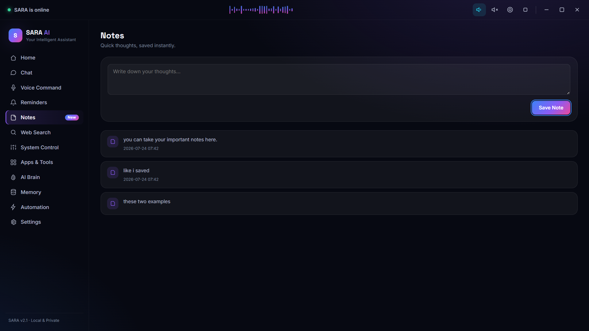
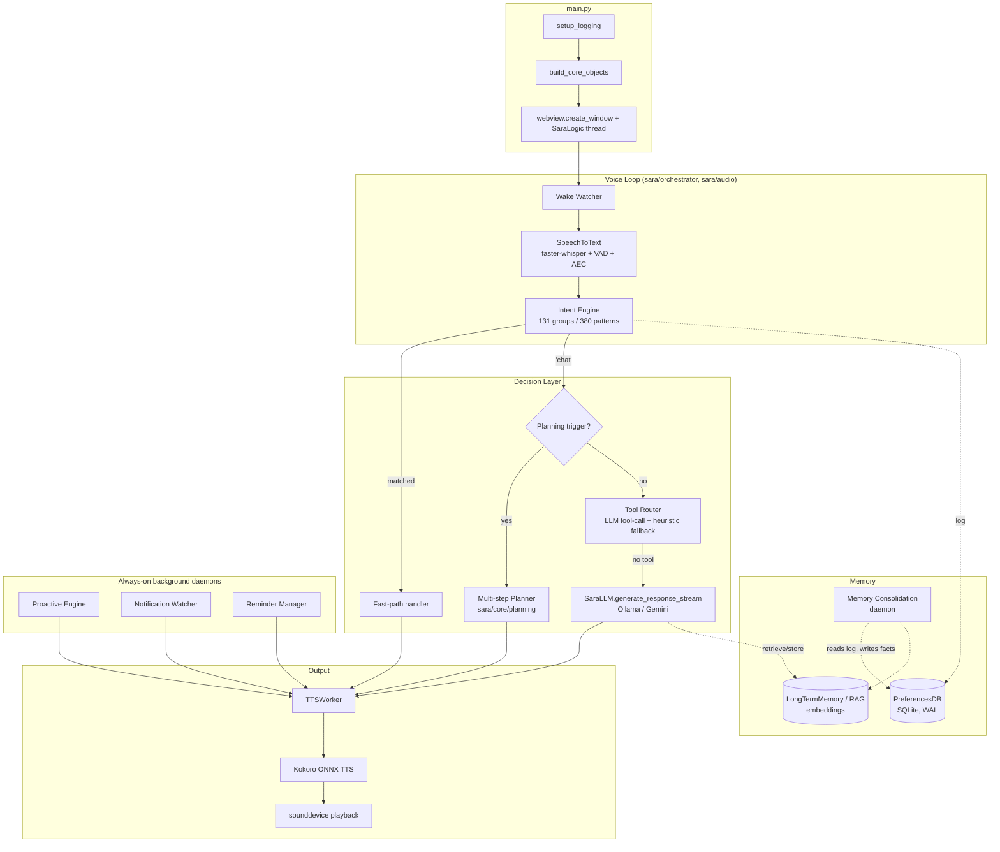
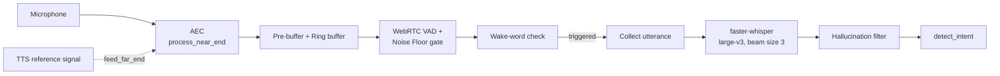
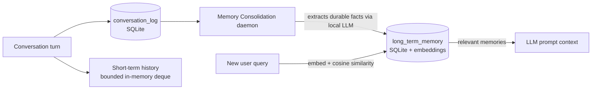

# 🎙️ SARA AI

**A local-first, voice-driven Windows desktop assistant** — wake-word activated, bilingual (English / Hindi / Hinglish), backed by a local LLM, and capable of multi-step tool-chaining, semantic long-term memory, and proactive, unprompted suggestions.

SARA runs entirely on your machine by default: speech recognition, text-to-speech, the language model, and memory all execute locally via [faster-whisper](https://github.com/SYSTRAN/faster-whisper), [Kokoro ONNX](https://github.com/thewh1teagle/kokoro-onnx), and [Ollama](https://ollama.com/). Google Gemini is available as an opt-in cloud backend, and a handful of tools (weather, news, web search) make outbound HTTP requests by design.

[](https://www.python.org/)
[](https://github.com/manvendrasingh0712/SARA-AI-Automation-Powered-Personal-Desktop-Assistant-voice-command-)
[](./LICENSE)
[](https://github.com/manvendrasingh0712/SARA-AI-Automation-Powered-Personal-Desktop-Assistant-voice-command-/actions/workflows/ci.yml)

---

## Table of Contents

- [What is SARA AI?](#what-is-sara-ai)
- [Feature Highlights](#feature-highlights)
- [Screenshots](#screenshots)
- [Architecture](#architecture)
- [Voice Pipeline](#voice-pipeline)
- [AI / LLM Architecture](#ai--llm-architecture)
- [Intent Engine & Tool Routing](#intent-engine--tool-routing)
- [Agentic Planning](#agentic-planning)
- [Memory & RAG](#memory--rag)
- [Proactive Engine](#proactive-engine)
- [Automation Capabilities](#automation-capabilities)
- [GUI Architecture](#gui-architecture)
- [Technology Stack](#technology-stack)
- [Project Structure](#project-structure)
- [Requirements](#requirements)
- [Installation](#installation)
- [Model Setup](#model-setup)
- [Configuration](#configuration)
- [Running SARA](#running-sara)
- [Building the Windows Executable](#building-the-windows-executable)
- [Testing & CI](#testing--ci)
- [Security / Privacy](#security--privacy)
- [Limitations](#limitations)
- [Roadmap](#roadmap)
- [Contributing](#contributing)
- [License](#license)
- [Acknowledgements](#acknowledgements)

---

## What is SARA AI?

SARA AI is a `pywebview`-based desktop application: a Python backend drives audio capture, a local LLM, and Windows automation, while an HTML/CSS/JS frontend renders a 14-page dashboard. You talk to it (wake word "Sara"/"Sarah") or type to it, and it can answer questions, hold a conversation, chain multiple tool calls together to satisfy a compound request, remember facts about you across sessions, and occasionally speak up on its own — a low battery, an upcoming reminder, a long idle stretch — without ever needing a wake word for those nudges.

The codebase is organized as a `sara/` package (96 Python modules) split by concern: `audio/` (STT/TTS/AEC), `core/` (LLM, intent engine, tool router, planning, memory/RAG), `orchestrator/` (the always-on conversation loop and background services), `gui/` (the pywebview bridge and frontend), `tools/` and `skills/` (automation and pluggable capabilities).

## Feature Highlights

| Capability | Summary |
|---|---|
| **Wake-word voice control** | Always-listening loop with configurable wake words, VAD, and echo cancellation |
| **Bilingual, code-switching** | English, Hindi, and Hinglish across STT, LLM prompting, and TTS, with automatic and manual language modes |
| **Local-first LLM** | Ollama (default: `qwen2.5`) with streaming responses; Gemini as an explicit opt-in cloud backend |
| **131 fast-path intents** | 380 regex patterns give instant (no-LLM) responses for common commands before ever reaching the model |
| **Multi-step planning** | A bounded agentic planner chains multiple tool calls together for compound requests ("remind me to call mom, then check the weather") |
| **Long-term semantic memory** | RAG-backed recall of facts from past conversations, plus a background consolidation daemon that periodically distills durable facts |
| **Proactive Engine** | Unprompted nudges for low battery, upcoming reminders, idle breaks, and streak milestones — with an "Explainable AI" `why did you say that?` intent |
| **114 Windows automation functions** | App/window control, power/session, volume/brightness, connectivity, Explorer/Settings shortcuts, services, system info, and more |
| **Skills plugin system** | Drop a single `.py` file into `sara/skills/` and it's auto-discovered and wired into the live intent matcher at startup |
| **14-page GUI dashboard** | Home, Chat, Voice, Reminders, Notes, Web Search, System, Apps, AI Brain, Memory, Automation, Analytics, Diagnostics, Settings |
| **Setup Wizard** | First-run onboarding that detects and helps fix missing Ollama models, the embedding model, and Kokoro TTS files |
| **Emergency stop hotkey** | Global panic-button hotkey (`Ctrl+Alt+S` by default) that halts Sara immediately |

## Screenshots

<table>
<tr>
<td width="50%"><br/><sub><b>Home</b> — status, weather card, quick actions</sub></td>
<td width="50%"><br/><sub><b>Chat</b> — typed conversation with streaming replies</sub></td>
</tr>
<tr>
<td width="50%"><br/><sub><b>Voice</b> — live transcript and wake-word status</sub></td>
<td width="50%"><br/><sub><b>AI Brain</b> — model, personality mode, and backend status</sub></td>
</tr>
<tr>
<td width="50%"><br/><sub><b>Memory</b> — long-term recall and the Sara Moments card</sub></td>
<td width="50%"><br/><sub><b>Automation</b> — routines and multi-step planning</sub></td>
</tr>
<tr>
<td width="50%"><br/><sub><b>System</b> — power, volume, brightness, connectivity</sub></td>
<td width="50%"><br/><sub><b>Apps</b> — application launch/close controls</sub></td>
</tr>
</table>

<details>
<summary>More screenshots (Reminders, Notes, Web Search, Settings)</summary>
<br/>
<table>
<tr>
<td width="50%"><br/><sub><b>Reminders</b></sub></td>
<td width="50%"><br/><sub><b>Notes</b></sub></td>
</tr>
<tr>
<td width="50%"><br/><sub><b>Web Search</b></sub></td>
<td width="50%"><br/><sub><b>Settings</b></sub></td>
</tr>
</table>
</details>

## Architecture



SARA has no separate backend server — everything above runs inside a single Python process, with each subsystem (voice loop, proactive engine, notification watcher, memory consolidation, DB writer) on its own daemon thread, coordinated through thread-safe queues and a shared `ui_update()` callback that pushes events to the JS frontend.

### Startup sequence (`main.py` → `sara/orchestrator/core_wiring.py`)

1. `main()` sets up logging, then hands off to `sara.gui.app.main()` (pywebview entry point).
2. `build_core_objects()` runs startup diagnostics (`health_check.py`), constructs the AEC processor, then builds `TextToSpeech`, `SpeechToText`, and `PreferencesDB` **concurrently** on a 3-worker `ThreadPoolExecutor` to shorten cold-start time.
3. Saved preferences (language mode, assistant-active state) are restored from SQLite.
4. The LLM (`SaraLLM`) and `VisionAssistant` are wrapped in a lazy-construction helper (`_Lazy`) so they aren't built until first actually needed — Ollama's own warm-up happens on a background thread.
5. The GUI window is created, the always-on `SaraLogic` thread starts (`run_sara_logic`), and boot progress is streamed to the frontend via a sequence of `ui_update("boot_progress", ...)` calls (diagnostics → audio engine → voice engine → preferences → core services → reminders → finalize).
6. Inside `run_sara_logic()`: the wake watcher, `ProactiveEngine`, notes-folder sync thread, and the memory-consolidation daemon are all started, each independently config-gated and each wrapped so a failure in one never blocks the others.
7. On shutdown: the emergency-stop hotkey and notification watcher are unregistered, pending preference writes are flushed, and the SQLite connection is explicitly closed (a WAL-flush fix — preferences used to occasionally fail to persist across restarts because the DB was never closed).

## Voice Pipeline



- **Capture & buffering**: `sara/audio/stt/` splits into `buffers.py` (`_PreBuffer`, `_RingBuffer`, `_VADFilter`, `_SilenceGate`, `_NoiseFloor`, `_CollectState`), `helpers.py` (RMS, language detection, hallucination filters), and `engine.py` (the public `SpeechToText` class).
- **Echo cancellation**: `sara/audio/aec.py` wraps the `aec-audio-processing` binding of Google's WebRTC Audio Processing Module. One `AECProcessor` instance is shared between TTS and STT — TTS continuously feeds the exact speaker samples as the far-end/reference stream, while STT runs every mic chunk through `process_near_end()` before it reaches the buffers, so genuine speech is no longer confused with SARA hearing her own voice.
- **Transcription**: local **faster-whisper**, `WHISPER_MODEL_SIZE=large-v3` by default, beam size 3, with configurable no-speech / log-prob / compression-ratio thresholds and a dedicated hallucination-repetition filter.
- **Wake word**: `openWakeWord`-based detection with an STT-fallback path (see [Limitations](#limitations) — a custom-trained wake-word model is on the roadmap, not yet shipped).
- **Language handling**: `STT_FORCE_LANG_FOR_HINGLISH` steers Whisper's language hint for Hinglish input; `LanguageState` (auto vs. manual) is shared across STT, the LLM prompt builder, and TTS voice selection.
- **TTS**: `sara/audio/tts/` — `voice_params.py` (language/voice/speed selection), `text_prep.py` (cleanup + adaptive sentence splitting for streaming), `synth.py` (Kokoro ONNX synthesis), `cache.py` (an LRU phrase cache), and `player.py` (a persistent `sounddevice`-callback-driven player with thread-local scratch buffers). Kokoro runs on ONNX Runtime with CUDA execution provider support (falls back to CPU automatically) and configurable per-language speed (`KOKORO_SPEED_EN` / `KOKORO_SPEED_HI`, clamped 0.5–2.0).
- **Barge-in**: the TTS worker polls for user speech during playback and can be interrupted mid-sentence; a post-TTS settle window (shorter when AEC is active, longer otherwise) prevents SARA's own trailing audio from being mistaken for a new utterance.

## AI / LLM Architecture

### Local (default)
- **Ollama**, default model `qwen2.5`, `OLLAMA_HOST` defaulting to `http://localhost:11434`.
- A background warm-up thread (`_warm_up_model`) sends a 1-token priming request at startup so the first real reply isn't paying Ollama's cold-load latency.
- Streaming responses are split into clause/sentence boundaries (`sara/core/llm/streaming.py`) so TTS can start speaking before the full reply has finished generating, with markdown stripped from the spoken text.

### Optional Cloud
- **Google Gemini** via `google-genai`, enabled by setting `LLM_BACKEND=gemini` and a valid `GEMINI_API_KEY`. `Config.validate()` raises a `ConfigError` at startup if `gemini` is selected without a key. Gemini is also used by `sara/tools/vision.py` for screenshot description regardless of `LLM_BACKEND`, since local vision-capable models aren't part of this stack.
- Falling back between backends is explicit (via config), not automatic mid-conversation.

### Prompting & history
- `sara/core/llm/prompt.py` builds a cached system instruction incorporating the current language, time-of-day (timezone-aware via `pytz`), and the user's name/preferences; it's rebuilt only when language or name actually changes.
- Conversation history is a bounded in-memory deque (`Config.MAX_MEMORY_EXCHANGES`), separate from the persistent long-term memory described below.

## Intent Engine & Tool Routing

SARA checks a fast, local, no-LLM-call regex layer **before** ever considering an LLM call — this is why simple commands ("open chrome", "what time is it") are near-instant.

- **131 intent groups**, **380 compiled regex patterns**, defined in `sara/core/intent/patterns.py` and matched by `sara/core/intent/engine.py`.
- Groupless multi-pattern intents (no capturing groups) are automatically merged into a single alternation regex, cutting the number of regex engine invocations per call.
- A cheap substring **gate** (`_INTENT_GATES`) is checked before running any of an intent's regexes, so most of the ~131 groups are skipped instantly for a given utterance.
- Results are memoized with an `lru_cache(maxsize=256)`, since voice commands repeat often.
- A conservative, opt-in-only **typo-correction rescue pass** (`difflib`-based, cutoff 0.8, 5+ letter words only) retries once against a corrected version of the text, but only after the exact text has already failed to match anything — it can never override a real match.
- **Runtime registration**: `register_intent()` lets `sara/skills/` plugins add new intents without editing this module, inserted at the *front* of the pattern list so they're checked before the broad catch-all patterns (`open_app`/`close_app`) that would otherwise swallow them.

When an utterance doesn't match a fast-path intent, it falls through to `sara/core/tool_router.py`: a real, bounded-time Ollama tool-calling request (native `tools=` support) against a 12-tool schema (`weather`, `news`, `web_search`, `open_url`, `play_youtube`, `play_spotify`, `screenshot_describe`, `clipboard_read`, `clipboard_write`, `open_app`, `close_app`, `calculator`), falling back to a deterministic keyword heuristic if the LLM call is unavailable, times out, or fails. Only if no tool applies does the message become an ordinary streamed LLM chat reply.

## Agentic Planning

For requests that genuinely need more than one action ("remind me to call mom at 6 and tell me the weather"), `sara/core/planning/` runs a bounded multi-step planner **before** falling back to the single-tool router:

1. **Trigger** (`trigger.py`) — a pure, allocation-light string check (no I/O, no LLM call) that only returns true when two distinct tool categories are referenced, or one category plus an explicit sequencing cue ("and then", "uske baad", Hindi "phir").
2. **Plan generation** (`planner.py`) — one single, bounded LLM round-trip proposes the *entire* plan up front (not one call per step), built from the same `TOOLS_SCHEMA` the tool router uses, so the planner can never drift out of sync with what the executor can actually dispatch.
3. **Validation** (`schema.py`) — every step's arguments are validated, including a hard-coded URL scheme allowlist (`http`/`https` only — `javascript:`, `data:`, `file:` etc. are always rejected) and a configurable application-launch allowlist (`APP_LAUNCH_ALLOWLIST` / `APP_LAUNCH_ALLOWLIST_ENABLED`).
4. **Execution** (`executor.py`) — a dedicated single-worker `ThreadPoolExecutor` per plan run, an absolute wall-clock total-plan timeout, per-step timeouts bounded by whatever time remains against that deadline, one self-correction retry per failed step, dependent-step skipping on unrecoverable failure, and explicit, never-silent partial-success reporting. Arguments are re-validated immediately before *every* dispatch attempt — including corrected arguments from the retry path — so a "corrected" `open_url`/`open_app` step can never bypass the security checks.

If planning is disabled (`Config.PLANNING_ENABLED=False`), the trigger doesn't fire, or the plan collapses to a single step, the caller falls through unchanged to the existing single-tool path — this feature is strictly additive.

## Memory & RAG



- **Structured storage** (`sara/core/memory.py` — `PreferencesDB`): one canonical SQLite database (`Config.DB_PATH`, WAL mode), holding preferences, `conversation_log`, `reminders`, `routines`, a `proactive_log`, and an `action_log` (audit trail of dispatched intents/skills/system actions, capped at the most recent 500 rows). A prior bug where preferences/reminders/conversation-log could silently split across three different physical `.db` files (each module computing its own path relative to CWD) was fixed by centralizing on `Config.DB_PATH`.
- **Long-term semantic memory / RAG** (`sara/core/rag.py` — `LongTermMemory`): a `long_term_memory` SQLite table (id, text, embedding BLOB, source, timestamp) in the same database file. Embeddings come from Ollama's `/api/embeddings` endpoint (`nomic-embed-text`, pulled separately) via a plain HTTP call — no extra ML dependency like `sentence-transformers`. Embeddings are cached in RAM as one `(N, D)` NumPy matrix; retrieval is cosine similarity over that in-memory matrix, which the module's own docstring is explicit is **not** a real vector database — appropriate at the scale of a single-user desktop assistant's memory, not a general-purpose retrieval system. Writes go through a background thread/queue (fire-and-forget); reads run on the calling thread with a hard embedding-call timeout, degrading to an empty result (never a crash) if Ollama is unreachable. Deletes (`delete_memory` / `clear_all`) go through the same async write path.
- **Memory consolidation** (`sara/core/memory_consolidation.py`): a periodic background daemon (`Config.MEMORY_CONSOLIDATION_ENABLED`) that reads recent raw `conversation_log` entries, asks the local Ollama LLM to extract a handful of short, durable facts, and stores them into the same `LongTermMemory` store — entirely local, no new network dependency beyond the Ollama server SARA already uses. It skips a tick silently (logged, not crashed) if Ollama is unreachable.
- **Forget mechanisms**: a voice-triggerable "forget that I like X" intent uses fuzzy matching (`MEMORY_FORGET_MATCH_THRESHOLD`) against stored memories before deleting; a separate exit-word set ("forget our conversation", "clear memory", "sab bhool jao") clears session-level state.
- **Notes Q&A**: `sara/skills/notes_qa.py` syncs a folder of `.txt`/`.md` class notes (`Config.NOTES_FOLDER`) into the same `LongTermMemory` store and answers questions against it — the first code path that actually exercised `LongTermMemory` end-to-end in this codebase.

## Proactive Engine

`sara/orchestrator/proactive.py` runs **Perceive → Reason → Act** on its own daemon thread, every `PROACTIVE_CHECK_INTERVAL_S` seconds (default 60s), speaking up without a wake word:

| Trigger | Signal | Notes |
|---|---|---|
| **Battery** | Low-battery threshold | Per-trigger cooldown; skipped entirely on desktops with no battery |
| **Reminders** | Upcoming reminder heads-up | Complements (doesn't replace) the reminder's own alarm |
| **Idle / break** | Extended idle time | Gentle nudge after a long stretch without interaction |
| **Streak milestones** | 3 / 7 / 14 / 30 / 50 / 100 / 200 / 365-day talk streaks | Backed by `PreferencesDB.record_interaction_day()` |

Each trigger has its own **Settings**-page toggle (`setting:proactive_battery`, `_reminders`, `_idle`, `_streak`), all defaulting ON, plus a master toggle (`setting:proactive_mode`) and hard silencers: `AssistantState` (Home page "Pause Listening") and Focus Mode. The optional LLM phrasing step deliberately bypasses `SaraLLM.generate_response()` (which would pollute real conversation history and can block on a cold model) in favor of its own small, stateless, isolated call — falling back to a plain template instantly on any failure. An **Explainable AI** intent (`why_proactive` — "why did you say that", "kyu bola") lets the user ask why SARA spoke, reading the reason back from the `proactive_log` table.

A sibling background service, the **Notification Watcher** (`sara/orchestrator/notifications.py`), follows the identical single-poll-loop-with-stop-event shape to watch one folder for a file "finishing" (size settling, or a `.crdownload`/`.part` temp file disappearing) and announce it once via TTS.

## Automation Capabilities

`sara/tools/system/` (~114 zero/low-argument functions) plus `sara/tools/` (reminders, calendar, clipboard, vision, web):

| Category | Examples |
|---|---|
| **Power / session** | Lock, sleep, hibernate, log off, shutdown, restart, cancel shutdown |
| **Volume / display** | Set volume (`pycaw`), adjust/set brightness (`screen_brightness_control`), brightness status |
| **Window management** | Show desktop, minimize/restore/maximize all or active window, snap left/right, switch window, move window, always-on-top, fullscreen toggle |
| **Media keys** | Play/pause, next/previous track, stop |
| **Keyboard shortcuts** | Copy/paste/select-all/undo/redo, tab management, zoom, scroll |
| **Connectivity** | Wi-Fi on/off, Bluetooth on/off, dark/light mode |
| **Files & folders** | Empty recycle bin, open Downloads/Documents/Desktop/Pictures/Music/Videos/This PC/Recycle Bin/File Explorer/Control Panel/Task Manager |
| **Windows Settings deep links** | Display, Sound, Bluetooth, Network, Update, Apps, Personalization, Privacy, Storage, Power, About, Night light, Airplane mode |
| **System info** | Disk usage, uptime, local IP, GPU status (`pynvml`), temperature, process list |
| **Services** | List Windows services; start/stop a named service |
| **Applications** | Open/close/switch-to by name, with a security-hardened app-launch allowlist |
| **Timers & reminders** | Set/cancel timers, add/list/cancel reminders with background alarm playback |
| **Clipboard** | Read/write clipboard (`pyperclip`) |
| **Notes** | Take/read/clear voice notes |
| **Web** | Weather (`wttr.in`, no key needed), news, web search, open URL, play YouTube/Spotify |
| **Google Calendar** | OAuth2 "installed app" flow + Calendar API v3 — list today's events, connection status |
| **Vision** | Screenshot capture + description via Gemini vision |

Everything routes through `SIMPLE_ACTIONS` (a zero-arg name→callable table, `sara/tools/system/dispatch.py`) for parameterless commands, or through the fast-path intent handlers / tool router / planner for anything needing arguments.

## GUI Architecture

- **Framework**: `pywebview` (`edgechromium`/WebView2 backend) — a native window hosting `sara/gui/index.html`, with a Python `Api` object exposed as `window.pywebview.api` to the frontend JS.
- **Python ↔ JS bridge**: the `Api` class (`sara/gui/app/engine.py`) is composed from 9 mixins — `ApiCoreMixin`, `ApiRemindersMixin`, `ApiSettingsMixin`, `ApiNotesMixin`, `ApiMediaMixin`, `ApiSetupWizardMixin`, `ApiCalendarMixin`, `ApiRoutinesMixin`, `ApiAnalyticsMixin` — with each mixin's public methods copied directly onto `Api.__dict__` at class-definition time. This works around a real bug: pywebview's WinForms/CEF fallback renderer (used automatically when WebView2 isn't available) only discovers `js_api` methods that live directly in the exposed class's own `__dict__`, not ones inherited from a mixin — plain multiple inheritance silently produced "(preview mode, no backend connected)" on any machine missing WebView2.
- **14 GUI pages** (`sara/gui/index.html`, confirmed via `data-page` attributes): Home, Chat, Voice, Reminders, Notes, Web Search, System, Apps, AI Brain, Memory, Automation, Analytics, Diagnostics, Settings.
- **Event flow**: Python pushes events to the frontend via a single coalescing `ui_update(kind, *args)` → `events._push()` bridge; events fired before the window has finished loading are buffered and flushed on the `loaded` event (fixing an early-boot race where the greeting/warm-up status could be silently dropped).
- **Setup Wizard**: first-run onboarding that checks whether Ollama, the configured model, the embedding model, and the Kokoro TTS files are present and working, streaming progress for long-running fixes (like an `ollama pull`) back over the same event bridge.
- **Analytics dashboard**: a self-contained JSON usage counter (`analytics_usage.json`) tracking most-used commands and day-by-day trend, independent of the main SQLite DB — it only sees commands that flow through the frontend's `send_text_command()` path (typed chat, quick actions), not pure voice commands.
- **Sara Moments**: a shareable "snapshot of your journey with Sara" card on the Memory page, driven by the same streak/usage data.
- **Personality touches**: festival-aware boot greetings (`_festival_greeting()`), and language toggles that switch response *personality*, not just STT/TTS voice.
- **Emergency stop**: a global hotkey (`EMERGENCY_STOP_HOTKEY`, default `ctrl+alt+s`) registered right after the `Api` object exists, calling `api.stop_sara()`.

Frontend size: `index.html` (1,244 lines), `js/app.js` (1,830 lines), `style/style.css` (2,361 lines).

## Technology Stack

| Layer | Technology |
|---|---|
| Language | Python 3.11 |
| Desktop shell | pywebview 6.2.1 (EdgeChromium/WebView2) |
| Frontend | HTML5, CSS3, vanilla JavaScript |
| STT | faster-whisper 1.0.3 (`large-v3`), webrtcvad, openWakeWord |
| TTS | Kokoro ONNX 0.5.0, ONNX Runtime (GPU + CPU), sounddevice, pygame |
| Echo cancellation | `aec-audio-processing` (WebRTC APM binding) |
| Local LLM | Ollama 0.6.2 (default model `qwen2.5`) |
| Cloud LLM (optional) | Google Gemini via `google-genai` 1.23.0 |
| Embeddings | Ollama `/api/embeddings` (`nomic-embed-text`) |
| Storage | SQLite (WAL mode) |
| System control | pycaw, comtypes, keyboard, screen_brightness_control, pywin32, winsdk, psutil, nvidia-ml-py |
| Web tools | requests, beautifulsoup4, ddgs / duckduckgo_search, yt-dlp |
| Calendar | google-auth, google-api-python-client (Calendar API v3) |
| Packaging | PyInstaller |
| CI | GitHub Actions (Windows runners): pyflakes lint, pytest + coverage, mypy (advisory) |

## Project Structure

```
.
├── main.py                      # Thin entry point
├── config.py                    # Centralized, validated configuration
├── health_check.py              # Startup diagnostics
├── logging_config.py
├── sara/
│   ├── audio/                   # STT (faster-whisper), TTS (Kokoro), AEC
│   │   ├── stt/                 # buffers.py, engine.py, helpers.py
│   │   └── tts/                 # cache.py, engine.py, player.py, synth.py, text_prep.py, voice_params.py
│   ├── core/
│   │   ├── intent/               # patterns.py (380 regexes), engine.py
│   │   ├── llm/                   # clients.py, engine.py, prompt.py, streaming.py
│   │   ├── planning/               # schema.py, planner.py, executor.py, trigger.py
│   │   ├── memory.py                # PreferencesDB (SQLite)
│   │   ├── rag.py                   # LongTermMemory (semantic recall)
│   │   ├── memory_consolidation.py  # Background fact-extraction daemon
│   │   ├── tool_router.py           # LLM tool-calling + heuristic fallback
│   │   └── routines.py
│   ├── orchestrator/            # The always-on conversation loop, split by concern
│   │   ├── core_wiring.py       # build_core_objects() + run_sara_logic()
│   │   ├── intent_handlers.py   # One handler per fast-path intent
│   │   ├── proactive.py         # ProactiveEngine
│   │   ├── notifications.py     # File-completion watcher
│   │   ├── tts_worker.py, db_writer.py, ollama_manager.py, emergency_stop.py, ...
│   ├── gui/
│   │   ├── index.html           # 14-page frontend
│   │   ├── js/app.js
│   │   ├── style/style.css
│   │   └── app/                 # bootstrap.py, engine.py (Api), core.py + 8 Api*Mixin files
│   ├── tools/                    # web.py, calendar.py, clipboard.py, reminders.py, vision.py
│   │   └── system/               # 114 automation functions across 13 category modules
│   └── skills/                    # Auto-discovered plugin skills (daily_briefing, joke, notes_qa, ...)
├── tests/                        # test_api_surface.py, test_planning.py, test_sara_smoke.py
├── assets/screenshots/           # 12 PNGs
├── .github/workflows/ci.yml
├── sara_ai.spec                  # PyInstaller build spec
├── BUILD.md, CONTRIBUTING.md, CHANGELOG.md, NEXT_STEPS.md, PROJECT_MEMORY.md
└── requirements.txt, requirements-build.txt
```

## Requirements

- **Windows 10/11** (this project is Windows-only — see [Limitations](#limitations))
- **Python 3.11**
- **[Ollama](https://ollama.com/)** installed and running locally
- An NVIDIA GPU is recommended for real-time TTS/STT (`onnxruntime-gpu`, CUDA 12.x / cuDNN 9.x) — falls back to CPU automatically if unavailable
- A working microphone and speakers/headphones (headphones or a good AEC setup strongly recommended to avoid SARA hearing herself)

## Installation

```bash
git clone https://github.com/manvendrasingh0712/SARA-AI-Automation-Powered-Personal-Desktop-Assistant-voice-command-.git
cd SARA-AI-Automation-Powered-Personal-Desktop-Assistant-voice-command-
python -m venv venv
venv\Scripts\activate
pip install -r requirements.txt
```

## Model Setup

```bash
# Pull the default local chat model
ollama pull qwen2.5

# Pull the embedding model used by long-term memory / RAG
ollama pull nomic-embed-text
```

Kokoro TTS requires two model files to be placed under `models/` (paths configurable via `KOKORO_MODEL_PATH` / `KOKORO_VOICES_PATH`):

```
models/
├── kokoro-v1.0.onnx
└── voices-v1.0.bin
```

## Configuration

SARA reads configuration from a `.env` file in the project root via `python-dotenv`; every setting has a safe default. Key variables:

| Variable | Default | Purpose |
|---|---|---|
| `LLM_BACKEND` | `ollama` | `ollama` (local) or `gemini` (cloud) |
| `OLLAMA_MODEL` | `qwen2.5` | Local chat model |
| `OLLAMA_HOST` | `http://localhost:11434` | Ollama server address |
| `GEMINI_API_KEY` | *(empty)* | Required only if `LLM_BACKEND=gemini` |
| `WAKE_WORDS` | `sara,sarah,hey sara,hey sarah` | Comma-separated wake phrases |
| `WHISPER_MODEL_SIZE` | `large-v3` | faster-whisper model size |
| `AEC_ENABLED` | `True` | Acoustic echo cancellation |
| `KOKORO_USE_GPU` | `True` | GPU-accelerated TTS synthesis |
| `TOOL_CALLING_ENABLED` / `TOOL_CALLING_MODE` | `True` / `llm` | LLM tool-calling fallback vs. keyword-only heuristic |
| `PLANNING_ENABLED` | `True` | Multi-step agentic planner |
| `APP_LAUNCH_ALLOWLIST_ENABLED` | `True` | Restrict which apps voice commands can open/close |
| `MEMORY_CONSOLIDATION_ENABLED` | `True` | Background long-term-fact extraction |
| `NOTIFICATIONS_ENABLED` | `True` | File-completion watcher |
| `EMERGENCY_STOP_ENABLED` / `EMERGENCY_STOP_HOTKEY` | `True` / `ctrl+alt+s` | Global panic-button hotkey |
| `WEATHER_API_KEY` | *(unset)* | OpenWeatherMap key for the Home page weather card (the voice `weather` tool itself uses key-free `wttr.in`) |
| `DEBUG_MODE` | `False` | Verbose logging + pywebview DevTools |

## Running SARA

```bash
python main.py
```

On first run, the **Setup Wizard** walks through checking Ollama, the configured model, the embedding model, and the Kokoro TTS files, with one-click fixes where possible. Say a wake word ("Sara") or type into the Chat page to begin.

## Building the Windows Executable

```bash
pip install -r requirements-build.txt
pyinstaller sara_ai.spec
```

Produces a one-folder build at `dist/SaraAI/SaraAI.exe`. The Kokoro model files and a real `.env` must be copied alongside the built exe (they are intentionally not bundled inside it, so they can be updated without a full rebuild). See [`BUILD.md`](./BUILD.md) for CUDA DLL bundling options, `comtypes` caching notes in a frozen build, and antivirus false-positive guidance.

## Testing & CI

```bash
pytest tests/ -v --cov=sara --cov-report=term-missing
```

Three test modules: `test_sara_smoke.py` (config validation, intent engine, calculator utilities), `test_api_surface.py` (guards the `Api` class's JS-bridge method surface against silent regressions), and `test_planning.py` (schema validation/security hardening, the planning trigger gate, planner, executor, and full `try_plan_and_execute()` integration, using stubbed test doubles — no real Ollama instance required).

CI (`.github/workflows/ci.yml`) runs on **`windows-latest`** (required — `requirements.txt` pins `winsdk`, which has no Linux wheel) across three jobs: `pyflakes` lint (fails only on real issues, not unused imports), `pytest` with coverage upload, and an advisory (`continue-on-error`) `mypy` type-check pass.

## Security / Privacy

- The **default** configuration is local-first: STT (faster-whisper), TTS (Kokoro), the LLM (Ollama), and all memory/storage (SQLite) run entirely on your machine, with no account or cloud dependency required to use the assistant.
- **Optional cloud calls exist and are explicit**: setting `LLM_BACKEND=gemini` sends chat prompts to Google's Gemini API; screenshot description (`sara/tools/vision.py`) always uses Gemini regardless of `LLM_BACKEND`, since this stack has no local vision-capable model. Weather (`wttr.in`), news, web search, and the OpenWeatherMap dashboard card all make outbound HTTP requests to their respective third-party services.
- API keys (`GEMINI_API_KEY`, `WEATHER_API_KEY`) are read from environment variables / `.env`, never hard-coded.
- `open_url` enforces a hard-coded `http`/`https`-only scheme allowlist (rejecting `javascript:`, `data:`, `file:`, etc.) regardless of source — fast-path intent, tool router, or multi-step plan.
- Voice-triggered app launch/close goes through a configurable allowlist (`APP_LAUNCH_ALLOWLIST_ENABLED`).
- This is **not** "100% private" in every configured mode — it is local-by-default with clearly scoped, opt-in or inherently-networked exceptions.

## Limitations

- **Windows-only.** Cross-platform support is an open roadmap item, not yet implemented (`pywin32`, `winsdk`, `pycaw`, and the WebView2-based pywebview backend are all Windows-specific).
- **Wake-word detection currently relies on an STT-fallback approach**, not a custom-trained wake-word model — a real trained model is on the roadmap.
- **GPU strongly recommended.** CPU-only inference works (automatic fallback) but is noticeably slower for both STT and TTS.
- **Model downloads required.** Ollama models and the Kokoro TTS files are not bundled and must be fetched/placed manually before first run.
- **The Proactive Engine, skills auto-discovery, and Setup Wizard have been verified via static analysis and stubbed-import tests, not yet a full real-hardware run** with live audio/GPU/Ollama, per the project's own `NEXT_STEPS.md`.
- **RAG memory is an in-memory cosine-similarity matrix, not a vector database** — appropriate for a single-user desktop assistant's memory scale, not intended to scale to a large multi-user corpus.
- **Only one file-notification watch is active at a time** (a stated v1 limitation of `sara/orchestrator/notifications.py`) — starting a new watch silently replaces the previous one.

## Roadmap

Per `NEXT_STEPS.md`, currently open items:

- [ ] Custom-trained wake-word model (replacing the current STT-fallback approach)
- [ ] Cross-platform support (currently Windows-only)

Recently completed and **no longer pending** (moved out of the roadmap into shipped features): calendar-aware and battery/system-state-aware proactive suggestions — now the Proactive Engine described above.

## Contributing

Contributions are welcome via issues and pull requests. See [`CONTRIBUTING.md`](./CONTRIBUTING.md) for the bug-report template, development setup, and PR process.

## License

MIT License — see [`LICENSE`](./LICENSE). Copyright (c) 2026 Manvendra singh.

## Acknowledgements

- [Ollama](https://ollama.com/) — local LLM serving
- [Google Gemini](https://ai.google.dev/) — optional cloud LLM and vision backend
- [faster-whisper](https://github.com/SYSTRAN/faster-whisper) — local speech-to-text
- [Kokoro ONNX](https://github.com/thewh1teagle/kokoro-onnx) — local text-to-speech
- [openWakeWord](https://github.com/dscripka/openWakeWord) — wake-word detection
- [ONNX Runtime](https://onnxruntime.ai/) — GPU/CPU inference backend
- [WebRTC](https://webrtc.org/) Audio Processing Module — acoustic echo cancellation (via `aec-audio-processing`)
- [pywebview](https://pywebview.flowrl.com/) — the desktop GUI shell
- [PyInstaller](https://pyinstaller.org/) — Windows executable packaging
- [pycaw](https://github.com/AndreMiras/pycaw) — Windows audio-endpoint control
