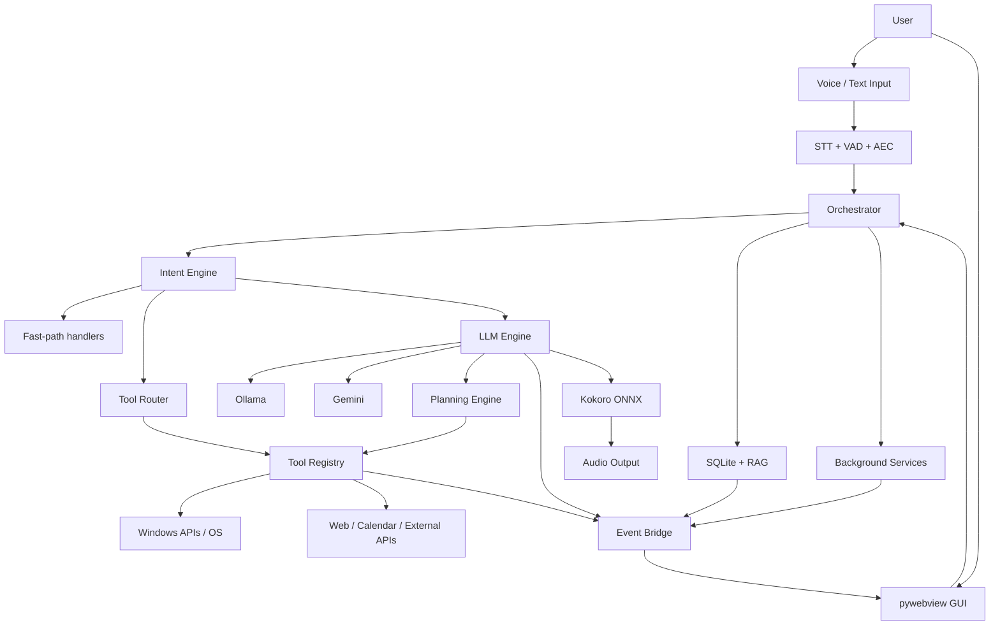

# SARA AI

<p align="center">
  
</p>

<p align="center">
  <strong>A voice-first AI desktop assistant for Windows, engineered for low-latency interaction, local inference, tool execution, semantic memory, automation, and a polished desktop UI.</strong>
</p>

<p align="center">
  <a href="https://github.com/manvendrasingh0712/SARA-AI-Automation-Powered-Personal-Desktop-Assistant-voice-command-">
    
  </a>
  <a href="https://www.python.org/">
    
  </a>
  <a href="https://ollama.com/">
    
  </a>
  <a href="https://github.com/SYSTRAN/faster-whisper">
    
  </a>
  <a href="https://github.com/thewh1teagle/kokoro-onnx">
    
  </a>
  <a href="./LICENSE">
    
  </a>
</p>

<p align="center">
  <a href="#-why-sara">Why SARA</a> •
  <a href="#-capabilities">Capabilities</a> •
  <a href="#-architecture">Architecture</a> •
  <a href="#-voice-pipeline">Voice</a> •
  <a href="#-agent-tooling">Agent</a> •
  <a href="#-memory-rag">Memory</a> •
  <a href="#-ui">UI</a> •
  <a href="#-setup">Setup</a> •
  <a href="#-engineering-notes">Engineering</a>
</p>

---

## What is SARA AI?

**SARA AI** is a Windows desktop personal assistant built as a real application rather than a single LLM wrapper.

It combines:

- real-time speech input and output
- deterministic intent routing for fast commands
- LLM-powered conversation and tool calling
- bounded multi-step planning
- persistent preferences and semantic long-term memory
- Windows automation and system controls
- reminders, notes, routines, web utilities, and calendar integration
- proactive background services
- a `pywebview` desktop UI backed by HTML/CSS/JavaScript

The central design goal is simple:

> **Keep common interactions fast and deterministic, use AI where reasoning is actually needed, and keep system actions behind explicit application-controlled tools.**

SARA is designed around a **local-first** deployment model. Ollama, faster-whisper, Kokoro ONNX, and SQLite can provide the core assistant experience locally; Gemini and several web integrations are available where the application explicitly requires or benefits from cloud services.

---

## Why SARA?

Most personal-assistant projects stop at:

```text
microphone → speech-to-text → LLM → text-to-speech
```

SARA goes further by treating the assistant as a **stateful desktop system**:

```text
                    ┌──────────────────────────┐
                    │       Voice / Text       │
                    └────────────┬─────────────┘
                                 ↓
                    ┌──────────────────────────┐
                    │ Intent + Context Layer   │
                    └────────────┬─────────────┘
                                 ↓
             ┌───────────────────┼───────────────────┐
             ↓                   ↓                   ↓
        Fast Intent         LLM / Agent         Memory / RAG
             ↓                   ↓                   ↓
             └───────────────────┼───────────────────┘
                                 ↓
                    ┌──────────────────────────┐
                    │  Policy + Tool Routing   │
                    └────────────┬─────────────┘
                                 ↓
             ┌───────────────────┼───────────────────┐
             ↓                   ↓                   ↓
        Windows Tools       Web / Calendar      Background Jobs
             └───────────────────┼───────────────────┘
                                 ↓
                    ┌──────────────────────────┐
                    │  Event / UI / TTS Output │
                    └──────────────────────────┘
```

This separation is what makes SARA interesting as an engineering project: the hard part is not calling a model, but coordinating **speech, state, tools, memory, safety, concurrency, and UI** in one long-running desktop process.

---

## ✨ Capabilities

<table>
<tr>
<td width="50%">

### 🎙️ Voice & Speech

- Wake-word based interaction
- Faster-Whisper speech recognition
- English, Hindi, and Hinglish workflows
- VAD / silence gating
- Acoustic echo cancellation
- Streaming-oriented TTS flow
- Barge-in / speech interruption handling
- Global emergency-stop hotkey

</td>
<td width="50%">

### 🧠 Intelligence

- Ollama local LLM support
- Gemini cloud backend support
- Context-aware prompting
- Streaming model responses
- Tool calling
- Heuristic tool-routing fallback
- Bounded multi-step planning
- Retry / correction paths

</td>
</tr>
<tr>
<td width="50%">

### 🛠️ Desktop Automation

- Application launch / close
- Window management
- Media controls
- Volume / mute / brightness
- Wi-Fi / Bluetooth controls
- Power/session actions
- Clipboard operations
- File and folder utilities
- Windows settings shortcuts
- System diagnostics

</td>
<td width="50%">

### 🧠 Memory & Productivity

- Persistent preferences
- Conversation history
- Semantic long-term memory
- Memory consolidation
- Notes and semantic notes Q&A
- Reminders and alarms
- Routines / automation
- Recent-action history
- Proactive notifications

</td>
</tr>
</table>

---

## 🏗️ Architecture

SARA is organized as a layered Python application with an independent web-based desktop presentation layer.



### Core responsibilities

| Layer | Responsibility |
|---|---|
| `sara/audio/` | Audio capture, STT, TTS, VAD/AEC and playback pipeline |
| `sara/core/` | Intent matching, LLMs, planning, memory, RAG and tool routing |
| `sara/orchestrator/` | Main conversation loop, lifecycle, background services, state and event flow |
| `sara/tools/` | External capabilities and Windows/system automation |
| `sara/skills/` | Auto-discovered, modular assistant skills |
| `sara/gui/` | pywebview application shell, JS bridge and UI implementation |
| `tests/` | API-surface, smoke, planner, RAG, routing and voice-flow tests |

---

## 🎙️ Voice Pipeline

SARA treats voice as a pipeline rather than a single API call.

```text
Microphone
   ↓
Audio capture
   ↓
Noise / silence gating
   ↓
VAD + AEC
   ↓
Wake-word / activation logic
   ↓
Faster-Whisper
   ↓
Intent + context processing
   ↓
LLM / tool / planner path
   ↓
Response streaming
   ↓
Sentence / clause preparation
   ↓
Kokoro ONNX
   ↓
Audio playback
```

### Latency-oriented design

The architecture deliberately tries to avoid unnecessary round trips:

1. deterministic commands are handled before expensive model inference
2. LLM responses can stream
3. TTS work is separated from the main command loop
4. frequent UI/audio updates are treated as events rather than blocking calls
5. long-running background tasks are separated from the interactive path

### Speech features

- `faster-whisper` for local STT
- `Kokoro ONNX` for local TTS
- configurable wake-word phrases
- configurable AEC sample rate and stream delay
- configurable English / Hindi voices and speech speed
- interruption handling for barge-in scenarios

---

## 🤖 Agent & Tooling

SARA uses multiple levels of command handling instead of sending every request directly to an LLM.

### Request routing

```text
User request
     ↓
Normalize / context
     ↓
Fast intent match
     ├── matched → direct handler
     │
     └── no match
           ↓
      Tool router / LLM
           ├── direct tool call
           └── compound request → planner
                                      ↓
                               validated steps
                                      ↓
                               bounded execution
                                      ↓
                               final response
```

### Tool design

System operations are grouped by capability rather than embedded in the model layer:

```text
sara/tools/system/
├── apps.py
├── audio_display.py
├── connectivity.py
├── files_notes.py
├── folders.py
├── media_keys.py
├── power.py
├── services.py
├── settings_pages.py
├── shortcuts.py
├── system_info.py
├── timers.py
├── window_control.py
└── window_mgmt.py
```

This keeps the LLM responsible for **choosing an action**, while Python remains responsible for **actually executing the action**.

### Bounded planning

The planning subsystem lives in `sara/core/planning/` and is intentionally constrained:

- maximum number of steps
- per-step timeout
- total plan timeout
- schema validation
- step retry / correction controls
- partial-result handling

Example:

```text
"Set a reminder for 6 PM and then tell me today's weather."

        ↓

1. create reminder
2. fetch weather
3. combine results
```

The planner is not intended to become an unrestricted autonomous agent; it is a **bounded execution layer** on top of SARA's explicit tool registry.

---

## 🧠 Memory & RAG

SARA separates conversational context from persistent memory.

### Memory layers

```text
┌─────────────────────────────────────────┐
│ Current conversation                    │
│ bounded short-term context              │
└────────────────────┬────────────────────┘
                     ↓
┌─────────────────────────────────────────┐
│ SQLite                                   │
│ preferences / history / reminders / log │
└────────────────────┬────────────────────┘
                     ↓
┌─────────────────────────────────────────┐
│ Long-term semantic memory               │
│ embeddings + cosine similarity           │
└────────────────────┬────────────────────┘
                     ↓
┌─────────────────────────────────────────┐
│ Consolidation                            │
│ recent conversations → durable facts     │
└─────────────────────────────────────────┘
```

### Current implementation

- SQLite with WAL mode for persistent state
- semantic retrieval with cosine similarity
- bounded conversation context
- background memory consolidation
- forget-memory controls
- notes indexing and semantic notes Q&A

The current RAG implementation is designed for a **single-user desktop workload**, not for large multi-tenant vector search.

> **Privacy note:** the architecture is local-first, but some capabilities intentionally use external services. See [Privacy & Data Flow](#-privacy--data-flow).

---

## 🖥️ Desktop UI

The desktop client uses **pywebview** to package an HTML/CSS/JavaScript interface around the Python backend.

### UI sections

```text
Home
Chat
Notes & Reminders
Apps
Automation
Settings
```

The UI is backed by a Python → JavaScript event bridge so assistant state can be reflected in the interface without moving the core application logic into the browser layer.

### Screenshots

<table>
<tr>
<td></td>
<td></td>
</tr>
<tr>
<td></td>
<td></td>
</tr>
<tr>
<td></td>
<td></td>
</tr>
<tr>
<td></td>
<td></td>
</tr>
<tr>
<td></td>
<td></td>
</tr>
</table>

---

## ⚙️ Technology Stack

| Layer | Technology | Role |
|---|---|---|
| Language | Python 3.11 | Core application and orchestration |
| Desktop shell | pywebview | Native desktop window + JS bridge |
| Frontend | HTML / CSS / JavaScript | Interactive assistant UI |
| STT | faster-whisper | Speech recognition |
| Wake / audio | VAD + AEC + wake-word logic | Voice activation and audio cleanup |
| TTS | Kokoro ONNX | Local speech synthesis |
| LLM | Ollama | Local model serving |
| LLM | Google Gemini | Optional cloud reasoning / vision path |
| Memory | SQLite | Persistent application state |
| Semantic memory | Embeddings + cosine similarity | Long-term retrieval |
| Windows automation | Python Windows APIs / system integrations | Desktop control |
| Packaging | PyInstaller | Windows executable builds |
| Testing | pytest | Automated test suite |
| Quality | pyflakes / mypy | Static checks and type validation |

---

## 📁 Project Structure

```text
SARA-AI/
│
├── main.py                         # Application entry point
├── config.py                       # Central configuration + validation
├── health_check.py                 # Environment / dependency diagnostics
├── logging_config.py               # Logging configuration
│
├── sara/
│   ├── audio/
│   │   ├── stt/                    # Speech recognition pipeline
│   │   ├── tts/                    # TTS synthesis, caching, playback
│   │   └── aec.py                  # Audio echo cancellation
│   │
│   ├── core/
│   │   ├── intent/                 # Fast intent matching
│   │   ├── llm/                    # Providers, prompting, streaming
│   │   ├── planning/               # Planner, executor, schemas, trigger
│   │   ├── memory.py               # Structured persistent memory
│   │   ├── rag.py                  # Semantic long-term memory
│   │   ├── memory_consolidation.py # Durable-memory extraction
│   │   └── tool_router.py          # Tool-call routing + fallback
│   │
│   ├── orchestrator/               # Runtime coordination
│   │   ├── core_wiring.py
│   │   ├── intent_handlers.py
│   │   ├── proactive.py
│   │   ├── notifications.py
│   │   ├── tts_worker.py
│   │   ├── db_writer.py
│   │   ├── emergency_stop.py
│   │   └── ...
│   │
│   ├── tools/
│   │   ├── calendar.py
│   │   ├── clipboard.py
│   │   ├── reminders.py
│   │   ├── vision.py
│   │   ├── web.py
│   │   └── system/                 # Windows automation capabilities
│   │
│   ├── skills/                     # Auto-discovered skills
│   └── gui/
│       ├── index.html
│       ├── js/
│       ├── style/
│       └── app/                    # Python ↔ JS bridge + API mixins
│
├── tests/
│   ├── test_sara_smoke.py
│   ├── test_api_surface.py
│   ├── test_tool_router.py
│   ├── test_planning.py
│   ├── test_barge_in_handoff.py
│   ├── test_fallback_and_misfire_retry.py
│   ├── test_rag_supersede_and_consolidation_gate.py
│   ├── test_sara_context_history.py
│   └── test_new_features.py
│
├── assets/screenshots/
├── requirements.txt
├── requirements-build.txt
├── BUILD.md
├── CHANGELOG.md
├── CONTRIBUTING.md
├── NEXT_STEPS.md
├── PROJECT_MEMORY.md
└── LICENSE
```

---

## 🔧 Setup

### Prerequisites

- Windows 10/11
- Python 3.11
- Working microphone and audio output
- Ollama for local LLM mode
- NVIDIA GPU recommended for practical real-time STT/TTS performance
- Kokoro model files

### 1. Clone

```powershell
git clone https://github.com/manvendrasingh0712/SARA-AI-Automation-Powered-Personal-Desktop-Assistant-voice-command-.git
cd SARA-AI-Automation-Powered-Personal-Desktop-Assistant-voice-command-
```

### 2. Create the virtual environment

```powershell
python -m venv .venv
.\.venv\Scripts\Activate.ps1
python -m pip install --upgrade pip
```

### 3. Install dependencies

```powershell
pip install -r requirements.txt
```

### 4. Install / start Ollama

Install [Ollama](https://ollama.com/), start the local service, then pull a model that matches your hardware.

Example:

```powershell
ollama pull qwen3:4b-instruct-2507-q4_K_M
```

Verify:

```powershell
ollama list
```

### 5. Configure environment variables

Create a local `.env` file in the repository root.

Recommended local-first starting point:

```dotenv
LLM_BACKEND=ollama
OLLAMA_HOST=http://localhost:11434
OLLAMA_MODEL=qwen3:4b-instruct-2507-q4_K_M

WAKE_WORDS=sara,sarah,hey sara,hey sarah

WHISPER_MODEL_SIZE=medium
KOKORO_USE_GPU=true
AEC_ENABLED=true

PLANNING_ENABLED=true
TOOL_CALLING_ENABLED=true
MEMORY_CONSOLIDATION_ENABLED=true
NOTIFICATIONS_ENABLED=true
EMERGENCY_STOP_ENABLED=true
EMERGENCY_STOP_HOTKEY=ctrl+alt+s
```

For Gemini mode:

```dotenv
LLM_BACKEND=gemini
GEMINI_API_KEY=your_api_key_here
```

Keep credentials out of source control.

### 6. Install Kokoro model files

Place the required model files under `models/` (or configure alternate paths in `.env`):

```text
models/
├── kokoro-v1.0.onnx
└── voices-v1.0.bin
```

### 7. Start SARA

```powershell
python main.py
```

---

## 🧪 Testing & Verification

Run the full suite:

```powershell
python -m pytest tests/ -v
```

Run a focused subsystem suite:

```powershell
python -m pytest tests/test_planning.py -v
python -m pytest tests/test_tool_router.py -v
python -m pytest tests/test_api_surface.py -v
```

Compile-check the project:

```powershell
python -m compileall -q .
```

Recommended static checks during development:

```powershell
pyflakes sara tests
mypy sara
```

### Testing philosophy

SARA separates deterministic unit behavior from hardware/cloud integration:

- API-surface tests protect the Python ↔ JavaScript contract.
- Planning tests use stubs rather than requiring a live LLM service.
- Routing tests cover tool selection and fallback behavior.
- Voice-flow tests cover barge-in / handoff behavior.
- RAG tests cover superseding and consolidation gates.
- Smoke tests protect core startup utilities and configuration paths.

For full confidence, live hardware validation is still required for microphone, audio loopback/AEC, GPU inference, Ollama, and Windows-specific integrations.

---

## 🔐 Privacy & Data Flow

SARA is designed to keep the primary assistant loop local, but **not every feature is offline**.

### Primarily local

- speech recognition via faster-whisper
- speech synthesis via Kokoro ONNX
- local LLM via Ollama
- persistent state via SQLite
- semantic retrieval executed from the local memory store
- Windows automation

### Networked by design

Depending on configuration and feature usage, SARA can communicate with:

- Google Gemini for cloud LLM / vision functionality
- web search / news / weather providers
- Google Calendar
- other explicitly configured third-party services

API credentials are intended to be supplied through environment variables rather than hard-coded in source files.

---

## 🧩 Extending SARA with Skills

The `sara/skills/` package provides a lightweight extension mechanism.

A skill can define its intent metadata and handler, then be discovered during application startup.

Conceptual example:

```python
INTENT_NAME = "example_skill"
PATTERNS = [r"do example (?P<value>.+)"]
DESCRIPTION = "Example SARA skill"


def handle(match, ctx):
    value = match.group("value")
    return f"Handled: {value}"
```

The goal is to add capabilities **without turning the central intent-pattern file into another monolithic registry**.

---

## 🛡️ Engineering & Safety Principles

SARA controls a real operating system, so the architecture treats tool execution differently from ordinary chatbot text generation.

### Principle 1 — The model does not directly control the OS

LLMs produce structured intent/tool requests. Python code performs the actual operation.

### Principle 2 — Prefer deterministic routing when possible

A known command should not pay the latency cost of a full reasoning round trip.

### Principle 3 — Bound autonomous behavior

Planning is constrained by step count, timeout, validation and retry policies.

### Principle 4 — Keep external services explicit

Cloud/network calls should remain identifiable in the architecture and configuration.

### Principle 5 — Long-running failures should be isolated

Background services should degrade independently instead of taking down the main conversation loop.

### Principle 6 — Observability matters

Subsystem boundaries, runtime state, errors, and background events should be diagnosable through structured logging and health checks.

---

## 📊 Engineering Snapshot

The current repository snapshot contains approximately:

| Metric | Current snapshot |
|---|---:|
| Python modules under `sara/` | 99 |
| Automated test modules | 9 |
| Python LOC under `sara/` | ~30.6K |
| UI screenshots | 12 |
| Main UI sections | 6 |

These numbers are descriptive rather than performance claims; they will naturally change as the project evolves.

---

## ⚠️ Current Limitations

SARA is an actively developed portfolio project. Important current constraints include:

- Windows-first implementation; cross-platform support is not currently a production target.
- CPU-only inference is supported but can be substantially slower than GPU-backed execution.
- Wake-word handling is not yet based on a custom-trained production wake-word model.
- Some capabilities require third-party network services.
- Full hardware validation is distinct from unit-test validation, especially for audio, GPU, and OS-specific integrations.
- Semantic memory is optimized for a single-user desktop workload, not large-scale multi-user retrieval.

For the active engineering backlog, see [`NEXT_STEPS.md`](./NEXT_STEPS.md).

---

## 🗺️ Roadmap

### Near term

- [ ] Harden command cancellation and interruption across all long-running operations
- [ ] Further reduce end-to-end voice latency
- [ ] Strengthen unified tool authorization / confirmation policy
- [ ] Improve local-provider parity across planning and memory features

### Longer term

- [ ] Custom wake-word model
- [ ] Broader cross-platform support
- [ ] More granular observability and performance telemetry
- [ ] More robust packaging / installer experience

The roadmap is intentionally focused on reliability, latency, and system integration rather than adding features indiscriminately.

---

## 📚 Documentation

- [`BUILD.md`](./BUILD.md) — Windows executable / packaging workflow
- [`CONTRIBUTING.md`](./CONTRIBUTING.md) — development and contribution guidance
- [`CHANGELOG.md`](./CHANGELOG.md) — implementation history
- [`NEXT_STEPS.md`](./NEXT_STEPS.md) — active engineering backlog
- [`PROJECT_MEMORY.md`](./PROJECT_MEMORY.md) — project architecture and state reference

---

## 🤝 Contributing

Contributions, issue reports, and architecture discussions are welcome.

Before opening a pull request:

1. keep changes scoped to one subsystem where possible
2. add or update tests for behavior changes
3. run the smoke / targeted tests relevant to the change
4. run compilation and static checks
5. update documentation when public behavior or configuration changes

See [`CONTRIBUTING.md`](./CONTRIBUTING.md) for the repository process.

---

## 📄 License

This project is released under the **MIT License**. See [`LICENSE`](./LICENSE).

---

## 🙏 Acknowledgements

SARA builds on several strong open-source projects:

- [Ollama](https://ollama.com/) — local LLM serving
- [Google Gemini](https://ai.google.dev/) — optional cloud LLM / vision
- [faster-whisper](https://github.com/SYSTRAN/faster-whisper) — speech recognition
- [Kokoro ONNX](https://github.com/thewh1teagle/kokoro-onnx) — local speech synthesis
- [openWakeWord](https://github.com/dscripka/openWakeWord) — wake-word tooling
- [ONNX Runtime](https://onnxruntime.ai/) — inference runtime
- [pywebview](https://pywebview.flowrl.com/) — desktop webview shell
- [PyInstaller](https://pyinstaller.org/) — Windows application packaging

---

<p align="center">
  <strong>SARA AI</strong><br/>
  <sub>Voice • Reasoning • Memory • Automation</sub>
</p>
